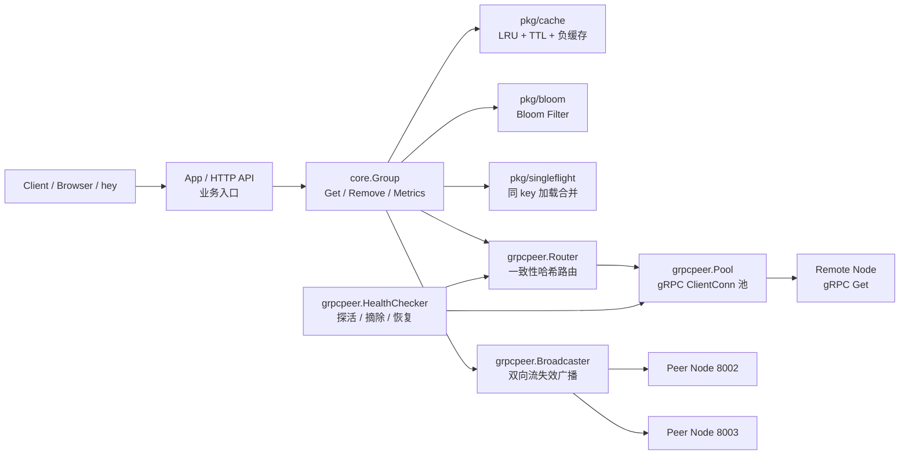
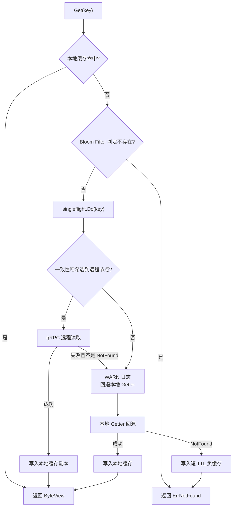
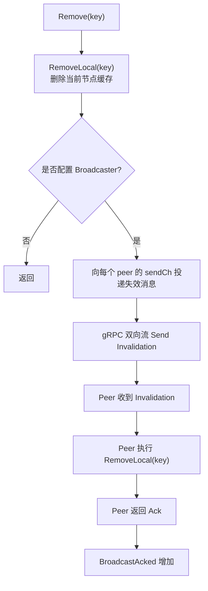

# distcache

`distcache` 是一个使用 Go 实现的分布式缓存项目，包含本地缓存、缓存过期、防穿透、防击穿、一致性哈希路由、gRPC 远程读取、gRPC 双向流缓存失效广播、健康检查与节点摘除恢复等能力。

项目重点是把一个缓存系统从单机能力扩展到分布式节点协作，并通过指标、日志和压测结果证明核心链路可运行。

## 核心特性

- LRU 缓存淘汰：基于哈希表 + 双向链表实现 O(1) Get/Add/Remove。
- TTL 过期：支持懒过期和后台 janitor 定期清理。
- TTL 抖动：降低大量 key 同时过期导致的缓存雪崩风险。
- 负缓存：对不存在的 key 短时间缓存空结果，减少重复回源。
- Bloom Filter：在回源前拦截明确不存在的 key，降低缓存穿透风险。
- singleflight：同一 key 的并发 miss 只触发一次加载，避免缓存击穿。
- 一致性哈希：将 key 路由到归属节点，减少节点变更时的缓存迁移范围。
- gRPC 远程读取：本地 miss 后可从 key 的归属节点读取数据。
- gRPC 双向流失效广播：删除 key 后向其他节点广播失效消息，并等待 Ack。
- 健康检查：周期检测 peer 状态，故障时摘除节点，恢复后重新加入哈希环。
- 优雅关闭：节点下线时先标记为 `NOT_SERVING`，等待 peer 摘除，再分别收尾出站与入站 gRPC 双向流。
- 运行指标：暴露缓存命中、回源、远程读、singleflight、广播、健康检查等指标。
- Prometheus 集成：调用方 HTTP 层可将指标快照转换为 `/metrics`，供 Prometheus 和 Grafana 抓取与展示。
- 结构化日志：使用 `log/slog` 记录启动、远程读、广播、健康检查等关键事件。

## 项目结构

```text
distcache
├── distcache.go          # 根包门面入口：New / NewGroup / Serve / Stop / Metrics
├── core                 # 缓存核心流程：Get/load/远程读取/本地回源/Remove/Metrics
├── grpcpeer             # gRPC 节点、连接池、路由、远程读取、广播、健康检查
├── httppeer             # HTTP peer 版本，保留用于兼容和测试
├── pkg
│   ├── bloom            # Bloom Filter
│   ├── cache            # 并发安全 LRU + TTL 缓存
│   ├── consistenthash   # 一致性哈希
│   ├── lru              # 泛型 LRU
│   └── singleflight     # 同 key 并发加载合并
├── QUICKSTART.md         # 根包使用示例和 demo 启动命令
└── PERFORMANCE_TEST_REPORT.md
```

Demo 可以放在独立应用中：

```text
path\to\your-app
```

Demo 应用负责启动节点、注册缓存组、初始化日志，并提供 HTTP 页面/API 作为演示入口。

## 架构概览



## 请求流程

### 读取流程



### 删除与失效广播流程



## 快速开始

推荐先看根包门面用法：

[Quick Start](./QUICKSTART.md)

根包入口示例：

```go
dc, err := distcache.New(distcache.Config{
	Addr:  "localhost:8001",
	Nodes: []string{"localhost:8001", "localhost:8002", "localhost:8003"},
})
if err != nil {
	log.Fatal(err)
}
defer dc.Stop()

scores := dc.NewGroup("scores", distcache.GetterFunc(
	func(ctx context.Context, key string) ([]byte, error) {
		db := map[string]string{
			"Tom": "630",
			"Sam": "567",
		}
		v, ok := db[key]
		if !ok {
			return nil, distcache.ErrNotFound
		}
		return []byte(v), nil
	}),
	distcache.WithBloomKeys("Tom", "Sam"),
)

go dc.Serve()
value, err := scores.Get(context.Background(), "Tom")
if err != nil {
	if errors.Is(err, distcache.ErrNotFound) {
		fmt.Println("key not found")
		return
	}
	log.Fatal(err)
}
fmt.Println(value.String())
```

### 单节点启动

```powershell
cd path\to\your-app
go run . -port 8001 -nodes localhost:8001 -api
```

访问：

```text
http://localhost:9999
```

### 三节点启动

开三个 PowerShell 窗口。

8001 节点，带 HTTP API：

```powershell
cd path\to\your-app
go run . -port 8001 -nodes localhost:8001,localhost:8002,localhost:8003 -api
```

8002 节点：

```powershell
cd path\to\your-app
go run . -port 8002 -nodes localhost:8001,localhost:8002,localhost:8003
```

8003 节点：

```powershell
cd path\to\your-app
go run . -port 8003 -nodes localhost:8001,localhost:8002,localhost:8003
```

注意：只有一个节点需要加 `-api`，因为 HTTP Demo 默认监听 `9999` 端口。

## Demo API

### 查询 key

```powershell
curl.exe "http://localhost:9999/get?key=Tom"
```

返回示例：

```text
630
```

### 删除 key

```powershell
curl.exe -X POST "http://localhost:9999/remove?key=Tom"
```

返回示例：

```text
ok
```

### 查看指标

```powershell
curl.exe "http://localhost:9999/stats"
```

`/stats` 会返回 group 和 node 两类指标，例如：

- `CacheHits`
- `CacheMisses`
- `BloomRejected`
- `PeerReads`
- `LocalLoads`
- `SingleflightShared`
- `BroadcastSent`
- `BroadcastAcked`
- `RingNodes`
- `PeerEjections`
- `PeerRecoveries`

## 健康检查流程

```text
HealthChecker 周期探测 peer
  ├── peer 返回 NOT_SERVING
  │     └── 立即摘除
  ├── 连续失败达到阈值
  │     └── 从一致性哈希环摘除
  └── 连续成功达到阈值
        └── 加回一致性哈希环
```

## 测试与压测结果

完整测试报告见：

[性能测试与验证报告](./PERFORMANCE_TEST_REPORT.md)

已完成的验证包括：

- 单节点功能验证；
- 单节点缓存命中压测；
- Bloom Filter 防穿透压测；
- singleflight 并发同 key miss 测试；
- 三节点 gRPC 远程读压测；
- gRPC 双向流缓存失效广播测试；
- 节点下线摘除与恢复测试；
- 节点优雅关闭与双向流收尾验证；
- 全量 `go test -race ./...` 竞态检测。

部分结果摘要：

```text
单节点本地缓存命中：
QPS 约 8.5 万，P95 约 2.8ms，P99 约 4.6ms。

三节点远程读：
100 并发请求同一个远程 key 时，只发生 1 次 gRPC 远程读取，
其余 99 个并发请求通过 singleflight 共享结果。

广播失效：
一次 remove 向两个 peer 发送失效消息，BroadcastSent=2，BroadcastAcked=2。

节点恢复：
节点下线后 RingNodes 从 3 降为 2，恢复后重新回到 3。

优雅关闭：
节点等待健康检查摘除后，出站广播流通过 CloseSend 收到 EOF，
入站广播流通过 shutdown 信号退出，GracefulStop 正常完成。

竞态检测：
go test -race ./... 通过，未检测到数据竞争。
```

## 日志与指标设计

项目使用 `log/slog` 记录结构化日志。

日志主要记录低频状态变化和异常事件：

- gRPC 节点监听成功；
- 远程读取失败并回退本地；
- 本地回源失败；
- 广播流连接、断开、发送失败；
- 节点摘除与恢复；
- 节点关闭和双向流收尾；
- GracefulStop 超时后强制 Stop。

高频事件主要使用 metrics，而不是逐条日志：

- 缓存命中/未命中；
- Bloom Filter 拦截；
- singleflight 合并；
- LRU 淘汰；
- TTL 过期；
- 健康检查次数；
- 广播发送和 Ack 总数。

这样可以避免在高并发场景下日志刷屏，同时保留排查问题所需的关键信息。

## 已知限制

- 当前测试主要在本地 Windows 单机环境完成，不代表多物理机生产性能。
- Demo 数据源是内存 map，并人为加入 `50ms` 延迟，不是真实数据库。
- 当前一致性设计是“失效广播 + TTL 兜底”的最终一致性倾向，不宣称强一致性。
- Prometheus exporter 位于调用方 HTTP 层，核心包保持对 Prometheus 的零依赖。
- HTTP API 主要用于演示和压测入口，核心节点通信使用 gRPC。

## 后续计划

- 编写真实三进程自动化集成测试；
- 补充更长时间的稳定性测试；
- 补充 CPU、内存、goroutine 等资源监控；
- 整理架构图和请求流程图；
- 完善 README 中的示意图和运行截图。

## 项目概述参考

可以概括为：

> 基于 Go 实现分布式缓存系统，支持 LRU、TTL、负缓存、Bloom Filter 防穿透、singleflight 防击穿、一致性哈希路由、gRPC 远程读取、gRPC 双向流缓存失效广播，以及健康检查驱动的节点摘除、恢复与优雅关闭；通过结构化日志和 `/stats` 指标观测缓存命中、远程读、广播 Ack、节点恢复等关键行为，并完成单节点和三节点场景下的功能验证、接口压测与竞态检测。
